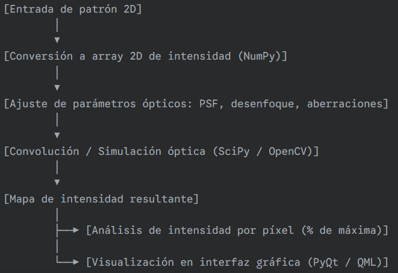

### **1. Funcionalidad principal**

* **Definir patrón de entrada**
  * Entrada: máscara o forma 2D.
  * Cada píxel tiene un valor de intensidad de luz asignado.
  * Representación interna: **array 2D** (NumPy).

* **Simulación de la proyección óptica**
  * Aplicar **convolución con la PSF** (Point Spread Function) para simular:
    * Difracción
    * Desenfoque
    * Aberraciones ópticas
  * Resultado: **mapa de intensidad en el fotoresist**.

* **Análisis de intensidad por píxel**
  * Cada píxel indica la **intensidad real** recibida.
  * Calcular porcentaje respecto al máximo.
  * Permite evaluar si la exposición será suficiente para cada área.

---

### **2. Requisitos técnicos**

* **Lenguaje:** Python
* **Librerías principales:**
  * **NumPy:** arrays y cálculos matriciales.
  * **SciPy / OpenCV:** convoluciones y procesamiento de imágenes.
  * **PyQt / QML:** interfaz gráfica interactiva.
* **Objetivo:** predecir la exposición antes de la fabricación física.

---

### **3. Pruebas de software**

1. **Patrón de entrada**

   * Verificar que se convierta correctamente a un array 2D.
   * Validar valores de intensidad asignados.

2. **Simulación óptica**

   * Comprobar que la convolución con la PSF difumine y distorsione la imagen correctamente.
   * Verificar que los efectos de resolución y aberraciones se reflejen en el mapa de intensidad.

3. **Salida de intensidad**

   * Confirmar que cada píxel tenga la intensidad correcta en porcentaje.
   * Asegurar coherencia de máximos y mínimos.

4. **Interfaz de usuario**

   * Verificar que los usuarios puedan cargar patrones, ajustar parámetros y visualizar resultados.
   * Comprobar la actualización dinámica del mapa de intensidad al cambiar parámetros.

### **4. Flujo del sistema**

